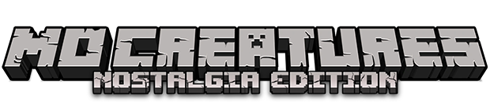

# Mo' Creatures: Aura Edition

**Mo' Creatures: Aura Edition** is a fan-made **slop port** of **Mo' Creatures: Nostalgia Edition for Minecraft 1.20.1 Forge** to **Minecraft 1.21.1 NeoForge**.

This port was made mainly for playing with friends. It may contain bugs, incomplete behavior, broken edge cases, or differences from the original versions. It should be safe for normal use in your own worlds, but because this is a modded port with custom entities and world generation, **making a backup of important worlds is still recommended**.

## Aura Edition

* **Aura Edition / Minecraft 1.21.1 NeoForge port author ~ meynoik**

`meynoik` is credited specifically for this Aura Edition port. Ownership and credit for the original mod, Nostalgia Edition work, assets, models, textures, sounds, and prior maintenance remain with their respective creators listed below.

## Nostalgia Team

* Lead Developer, Codebase Cleanup, General Maintenance ~ multision
* Project setup, Spawn Logic, Codebase Cleanup, bugfixes ~ [TheidenHD](https://github.com/TheidenHD/mocreaturesdev)

## Legacy Team [v12.1.0 and below]

* Author, Coding, AI, Animations, Models, Textures ~ DrZhark
* Models, Textures ~ BlockDaddy
* Coding ~ Bloodshot

## Special Thanks: Extended Team

* Lead Developer, Codebase Cleanup, Spawn Logic, General Maintenance ~ ACGaming
* Developer, Sound Artist, Language/Model Adjustments, General Maintenance ~ IcarussOne
* QA Analyst & Testing, Entity Spawn Rules ~ xJon
